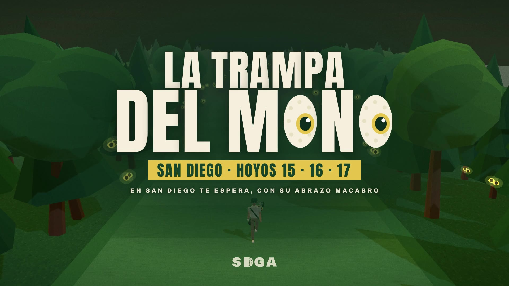

# Intro — La Trampa del Mono



Video de 36,8 s para la intro de la canción, en dos formatos: **vertical 9:16 (1080×1920)** para el celu y horizontal 16:9 (1920×1080). Está hecho con [HyperFrames](https://github.com/heygen-com/hyperframes)
(HTML + GSAP + Three.js) y el design system del SDGA: verde del campo, crema, banda dorada, Anton + Archivo.

Un jugador con la Boina Verde camina sin fin por el fairway del 15. La cámara va adelante, en diagonal, caminando para atrás.
A medida que la letra avanza, se nubla, los árboles se cierran y se abren los ojos de los monos. En el drop se hace de noche,
cruzan los monos, la pelota se pierde en el cielo (+1) y cae uno colgado. En el corte de la canción entra el logo
**LA TRAMPA DEL MONO**: las dos O de MONO son ojos de mono con hoyuelos de pelota de golf, y mientras tanto la voz arranca
con "Caminás tranquilo por el fairway…".

## Archivos

- `index.html` — la composición horizontal (16:9): capas de texto (la letra) y el logo.
- `compositions/vertical.html` — la misma composición en vertical (9:16): misma escena y mismos tiempos, otro encuadre y otra diagramación.
- `textos.js` — el timeline GSAP de los textos y el logo, compartido por los dos formatos.
- `escena-core.js` — la escena 3D (Three.js): jugador, fairway infinito, árboles con ojos, monos, pelota, cartel del 15, cámara.
  Todo se calcula a partir de un tiempo t, así que cada cuadro sale igual siempre. `escena.js` la conecta con HyperFrames (`hf-seek`).
- `app.js` — la intro dentro de la app (en vivo, al ritmo de la canción), con EMPEZAR/SALTAR y la pantalla de inicio en loop.
  `app-overlay.js` lo genera `armar-app.mjs` (lo corre `node build-web.mjs`) con los textos y el logo de las composiciones.
- `cues.js` — **los tiempos**, medidos sobre la canción (180,7 bpm; un compás = 1,3285 s). Si se cambia el mp3, se toca acá.
- `assets/trampa-del-mono.mp3` — la canción (Suno). `assets/sdga-logo.svg` — el logo oficial del design system.
- `assets/fonts/` — Anton y Archivo (OFL). `assets/vendor/` — three.js 0.181.2 y GSAP 3.14.2, locales para que el render no dependa de la red.
- `trampa-del-mono-intro-vertical.mp4` y `trampa-del-mono-intro.mp4` — los videos ya renderizados (versión liviana); `poster.jpg` — el cuadro del logo.
- **Dos presentaciones oficiales:**
  - `compositions/presentacion.html` — la **vertical (9:16, 75 s)**, la de la app: la intro y las funciones con capturas del juego.
    La arma `armar-presentacion.mjs` desde `compositions/vertical.html`; `escena-presentacion.js` remapea el tiempo de la escena 3D;
    las capturas están en `assets/capturas/`. Video: `trampa-del-mono-presentacion.mp4`.
  - `compositions/presentacion-horizontal.html` — la **horizontal (16:9, 2:09, la canción entera)**, para mandar por WhatsApp, con el juego
    de verdad. La arma `armar-presentacion-horizontal.mjs` (con `presentacion-horizontal.css`) a partir de `index.html`:
    si se toca la intro, volver a correrlo. `escena-presentacion-horizontal.js` remapea el tiempo de la escena 3D y `mapa.js` es el
    vuelo 3D sobre el dibujo de la cancha (`assets/cancha.webp`; los datos los saca `armar-mapa.mjs` a `mapa-datos.js`).
    Video: `trampa-del-mono-presentacion-horizontal.mp4`.
- `assets/juego/` — el juego grabado cuadro por cuadro (ver `rodaje/`): las tomas (`*.mp4`), sus marcas de tiempo (`tomas.json`),
  las cartas del plantel, las caras, la imagen para compartir y los efectos de sonido del juego (`sfx/`).
- `rodaje/` — las herramientas para grabar el juego: un navegador que juega solo con un reloj virtual (ver más abajo).

## Mapa de la canción (0–36,8 s)

| Tiempo | Música | Imagen |
|---|---|---|
| 0,2 | crescendo | de negro al fairway, toma baja de los pies; SDGA PRESENTA |
| 0,92 | primer golpe | sube la grúa y presenta al jugador (pisa a tempo: un ciclo de pasos por compás) |
| 3,6 | | CAMINÁS TRANQUILO |
| 9,6 | | pasa el cartel del HOYO 15 · "pero al llegar al quince…" |
| 11,5 | | se nubla · CAMBIA LA SITUACIÓN |
| 14,2 | | se abren ojos en los árboles · LOS ÁRBOLES TE MIRAN |
| 19,4–20,6 | baja y se corta | se frena, mira para todos lados · "te rodean en silencio" |
| 20,7 | vuelve la base | cabeza de un lado al otro en cada negra |
| 22,18 | **drop**, entra toda la banda | flash, noche, todos los ojos abiertos · YA SENTÍS LA TENSIÓN |
| 24,8 | | cruzan los monos de pinos a pinos |
| 26,2 | | la pelota se pierde en el cielo · +1 SE LA LLEVÓ EL MONO |
| 27,5 | solo | gira sobre sí mismo · NO HAY ESCAPE |
| 30,2 | | mira a cámara, cae el mono colgado |
| 31,48 | **corte**, entra la voz | LA TRAMPA DEL MONO |
| 32,8 | vuelve la banda | se abren los ojos de MONO, banda dorada |
| 36,1–36,8 | fin de "…cambia la situación" | fundido a verde |

## La presentación oficial horizontal (16:9, 0–128,8 s, para WhatsApp)

| Tiempo | Música | Imagen |
|---|---|---|
| 0–31,5 | la intro | la intro horizontal tal cual |
| 31,48 | corte, entra la voz | LA TRAMPA DEL MONO; el ojo de la segunda O crece hasta que la pupila tapa todo |
| 34,1 | verso | el juego en un teléfono, con la letra a la izquierda: 01 la portada y el nombre · 02 el mazo (las cartas pasan con el dedo) |
| 40,8 | | 03 HOYO 15 y la cuenta regresiva cortada a tempo (3, 2, 1, ¡YA!) |
| 43,4 | "cada golpe es un reto…" | 04 el drive: zoom al dedo que tira para atrás; suelta justo en "la pelota vuela" (46,1); el reloj y el viento |
| 48,7 | "entre ramas y hojas…" | 05 un mono se la lleva al vuelo (zoom) · 06 ¡VIENEN LOS MONOS! |
| 54,06 | **estribillo** | el teléfono se viene encima y el robo queda a pantalla completa (+1) · la escena 3D de noche |
| 59,4 | | tres pantallas: el Mono malo, el Mono bueno, el perro |
| 64,7 | "…es casi un milagro" | el approach y el putt que da la vuelta al hoyo y entra justo en 68,7: ¡BIRDIE! |
| 70,0 | "en San Diego te espera…" | vuelo 3D sobre el dibujo de la cancha: los tres hoyos y ojos en los árboles |
| 75,3 | la canción baja | el plantel: las 10 cartas en una rueda 3D |
| 83,3 | | CADA UNO CON SU HABILIDAD |
| 85,9 | toda la banda | las habilidades de a dos, cada una jugada de verdad: Miguelón y Fito, el Mago y la Mugre, el Perro y Lechu, el Ninja y LG |
| 107,2 | | 07 la tarjeta: firmada (récord, 1° en el ranking, la imagen para compartir) y sin firmar (comunicado del Marshall, 110 neto) |
| 113,8 | se corta el bajo | 08 el ranking |
| 117,8 | el final | la pantalla de inicio: logo, el jugador caminando, ojos de mono, JUGALA YA, el ícono y un QR; en 124,5 se cierran todos los ojos y en el último golpe se abren de una |

Los efectos de sonido son los del juego (sonido.js), sacados a mp3 con `rodaje/sfx.cjs`: la cuenta, el golpe, los monos,
la embocada, el perro, el pancho, el LP, la firma y el Marshall.

## El rodaje (`rodaje/`)

El juego se graba de verdad, jugando: Playwright abre `index.html` con un reloj virtual (`reloj.js`: `performance.now`, timers,
`requestAnimationFrame` y las animaciones CSS/SMIL avanzan solo cuando el rodaje lo pide), así cada cuadro sale a 30 fps exactos
aunque dibujar en 3x tarde. `Math.random` lleva una semilla: la misma semilla y los mismos gestos dan siempre la misma jugada.
`bot.js` apunta como el bot de `calibrar.mjs` y convierte el tiro en un gesto (el dedo apoya en la pelota y tira para atrás);
se ve un círculo donde toca el dedo, como en las grabaciones de pantalla del iPhone.

```bash
cd intro/rodaje && npm install          # playwright-core y las fuentes (Chromium aparte; CHROME=ruta si no está en /opt/pw-browsers)
python3 -m http.server 8765 --bind 127.0.0.1 --directory ../..   # el juego, en otra terminal
node t-vuelta.cjs 3                     # la vuelta principal (portada, mazo, hoyo 15 con birdie) → tomas/vuelta-3
node t-hab.cjs bomba 5 graba            # una jugada: bomba, aguila, chipin, mago, pancho, ladron, bosque, perro, dada, ninja, lg
node t-hab.cjs perro 1                  # sin "graba": explora rápido en 1x y muestra cómo sale (para elegir semillas)
node t-final.cjs 3 firma graba          # vuelta entera y la tarjeta (firma o marshall)
node t-plantel.cjs                      # las 10 cartas
node sfx.cjs                            # los efectos del juego a assets/juego/sfx
node juntar.cjs                         # pasa las tomas de elegidas.json a ../assets/juego (mp4 + tomas.json)
cd .. && node armar-presentacion-horizontal.mjs && npx hyperframes@0.8.114 render -c compositions/presentacion-horizontal.html --output trampa-del-mono-presentacion-horizontal.mp4
```

## Cómo se trabaja

```bash
cd intro
npx hyperframes@0.8.114 lint                      # chequeo rápido
npx hyperframes@0.8.114 snapshot --at 6,22.5,33   # cuadros sueltos para mirar
npx hyperframes@0.8.114 preview                   # Studio con el timeline (abre el navegador)
npx hyperframes@0.8.114 render --output trampa-del-mono-intro.mp4                              # 16:9
npx hyperframes@0.8.114 render -c compositions/vertical.html --output trampa-del-mono-intro-vertical.mp4   # 9:16
node armar-presentacion.mjs && npx hyperframes@0.8.114 render -c compositions/presentacion.html --output trampa-del-mono-presentacion.mp4   # 9:16 (app)
node armar-presentacion-horizontal.mjs && npx hyperframes@0.8.114 render -c compositions/presentacion-horizontal.html --output trampa-del-mono-presentacion-horizontal.mp4   # 16:9 (WhatsApp)
```

El render usa WebGL por software si no hay GPU: tarda ~1 s por cuadro. `snapshot` y `preview` miran `index.html`;
para revisar la vertical rápido: `render -c compositions/vertical.html --fps 2 --quality draft`.
